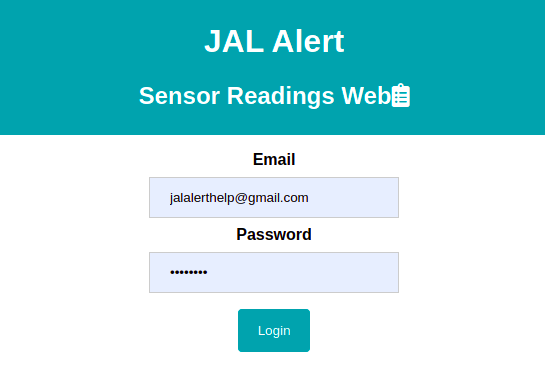

# JAL-Alert
This repo contains the code for our product JAL Alert

## Web App

## Product - JAL Alert

## Install Libraries
Firebase ESP Client - https://github.com/mobizt/Firebase-ESP-Client

## References:
https://randomnerdtutorials.com/
